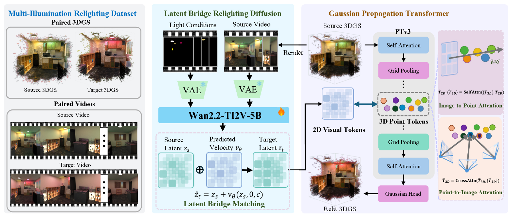

这篇笔记整理的是 [*LightBridge: Feed-Forward Generative Relighting for 3D Gaussian Splatting*](https://arxiv.org/abs/2609.02543v1)。它处理的是已有 3DGS 场景的重打光：给定场景和目标光源的亮度、颜色，直接得到新光照下的 3DGS。

通常，生成式重打光方法先修改一组渲染图像，再优化 3DGS，将图像中的变化写回场景。LightBridge 把这两步都改成网络预测：视频模型一步预测光照变化，3D 网络据此输出每个高斯的 SH 残差。

*图来自论文 Figure 2。图中同时画出了目标 latent；根据正文式 (6) 和附录，实际送入 3D 网络的是预测的 latent 速度。*

## 输入与输出

输入包含完整的源场景 $G^s$、相机轨迹 $C$ 和目标光照控制。每个高斯由中心 $\mu_i$、不透明度 $\alpha_i$、尺度 $s_i$、旋转 $q_i$ 和 SH 系数 $h_i^s$ 表示。输出只更新 SH：

$$
G^t=\left\{(\mu_i,\alpha_i,s_i,q_i,h_i^s+\Delta h_i)\right\}_{i=1}^{N}.
$$

因此，模型不需要重新预测几何，高斯的数量与身份也保持不变。目标照明仍然编码在 SH 外观中；每次改变光照条件，都需要再预测一份对应的 $G^t$。

## 从源场景准备视频条件

首先沿轨迹 $C$ 渲染源视频 $V^s=\mathcal R(G^s,C)$，论文使用 81 帧、$512\times512$ 的配置。场景是静态房间，帧之间的变化来自相机移动。视频 VAE 在时间和空间上压缩这段视频，得到源 latent $z_s$。

目标光照通过与视频逐帧对齐的三通道 mask $L$ 输入。在受控光源的可见区域 $M_k$ 中，填入目标强度 $i_k$ 与 RGB 颜色 $c_k$ 的乘积；其余区域填 $(-1,-1,-1)$。训练数据中的光源区域来自 Infinigen 的分割标注。这个 mask 指定的是光源控制值，墙面、地面等表面受到的照明变化由模型预测。$L$ 同样经过 VAE 编码，得到光照 latent $l$。

模型还接收相机信息。每个 latent 分辨率 patch 的射线用 Plücker 坐标 $(o\times d,d)$ 表示，其中 $o$ 为相机中心，$d$ 为单位射线方向。该表示经 MLP 投影后，加到对应视频 token 上。

视频主干基于 **Wan2.2-TI2V-5B**。源视频 latent、光照 latent 和当前 bridge state 沿时间维度拼接，以分开的旋转位置编码区分，然后送入 DiT 联合处理。

## Latent Bridge：一步预测光照变化

源视频与目标视频具有相同的场景和视角，模型可以从已有内容出发，学习两者之间的变化。训练时，将配对视频编码为 $z_s,z_t$，构造中间状态：

$$
z_\tau=(1-\tau)z_s+\tau z_t+
\sigma\sqrt{\tau(1-\tau)}\epsilon,
\qquad \epsilon\sim\mathcal N(0,I),\quad \sigma=0.005.
$$

网络 $v_\Phi$ 根据当前状态、时间和条件 $c$，预测向目标 latent 移动的速度。论文采用的监督为：

$$
\mathcal L_{\mathrm{bridge}}
=\mathbb E\left[
\left\|v_\Phi(z_\tau,\tau,c)-\frac{z_t-z_\tau}{1-\tau}\right\|_2^2
\right].
$$

训练从 $\{0,\frac14,\frac12,\frac34\}$ 中采样 $\tau$。默认推理只使用起点 $\tau=0$：此时噪声项消失，$z_\tau=z_s$，监督目标恰好变为完整的 latent 差 $z_t-z_s$。于是一次网络调用就得到：

$$
\Delta z=v_\Phi(z_s,0,c)\approx z_t-z_s.
$$

这里的“速度”是 latent 空间中的更新量。一步预测能够成立，是因为模型在源端点处就被训练去预测完整变化，并非直接删掉普通扩散模型的采样循环。

随后将 $\Delta z$ 划分为 patch，得到传给 3D 网络的视觉 token：

$$
T_{2D}=\operatorname{Patchify}(\Delta z).
$$

**完整流程无需把它解码成目标视频。** 只有单独评估视频重打光时，才计算 $\hat z_t=z_s+\Delta z$ 并通过 VAE 解码。使用变化量作为中间表示，也让后面的 3D 网络更直接地接收光照编辑信息；附录中，这种表示比目标 latent 收敛更快。

## 将变化写入完整 3DGS

Gaussian Propagation Transformer 以 **PTv3 编码器—解码器**为骨架。它先将源高斯属性嵌入为点 token，通过五个编码阶段的注意力和网格池化逐步聚合空间信息，再用四个解码阶段恢复到逐高斯分辨率。

2D 与 3D 的交互只插在第二个编码阶段 `enc1`。此处特征已经池化到有效 $64^3$ 网格上的稀疏体素 token；一个 token 可以对应同一体素中的多个高斯。这样不必让全部图像 token 与几十万个原始高斯做全连接注意力。

### 按渲染贡献建立对应

对每个图像 patch，先确定它对应的相机。由于视频 VAE 做了时间压缩，一个 latent token 可能覆盖多帧，论文取其时间感受野内第一帧的相机姿态。

然后筛出投影中心落在该 patch 内的高斯，按 splatting 贡献 $\alpha_iT_i$ 排序，其中 $T_i$ 表示透射率。同一池化体素中的高斯贡献相加，作为该 3D token 的分数，最终保留 **top-12** 个 token。这个邻域由渲染对应建立，考虑了哪些高斯实际贡献了当前图像区域。

### 两次注意力融合

第一次是 **Image-to-Point Self-Attention**。将一个图像 token $p$ 与其 12 个邻居 $\{a_k\}$ 放在一起做局部 self-attention：

$$
(\tilde p,\{\tilde a_k\})
=\operatorname{SelfAttn}(p,\{a_k\}).
$$

两类 token 都会更新：图像 token 获得局部 3D 外观上下文，点 token 吸收对应区域的光照变化。

第二次是 **Point-to-Image Cross-Attention**。同一个 3D token 可能出现在多个视角中，网络收集与它关联的、经过上一步更新的图像 token，以 3D token 作 query、图像 token 作 key/value，汇总多视角线索：

$$
\hat a_i=\operatorname{CrossAttn}
\left(\tilde a_i,\tilde{\mathcal P}(\tilde a_i)\right).
$$

例如，同一面墙在不同视角中可能得到略有差异的颜色变化预测。这一步以共同的 3D 位置为汇聚对象，融合这些预测后再决定如何更新外观。

融合后的特征继续经过 PTv3 的其余编码层和解码器，最后由 MLP 为每个高斯预测 $\Delta h_i$，与源 SH 相加。输入轨迹外的区域主要依靠完整场景的空间上下文传播，以及训练中轨迹外视图的监督获得更新；它们并没有额外的直接观测。

## 训练方式

数据使用同一房间在不同光照下的配对观测。作者先用 Cycles 渲染单光源 OLAT 基底，在线性 HDR 空间中按目标光源颜色和强度组合，再映射到 sRGB。每个房间有 30 种光照、六条轨迹，每条轨迹 81 帧。

3DGS 资产也保持对应：先用 ConeGS 重建一个固定 50 万高斯的参考场景，其他光照版本固定几何属性，只优化 SH。模型分三个阶段训练：

1. **训练视频模型。** 用真实渲染的源、目标视频训练 bridge loss，学习光照变化。微调 Wan 的条件适配器与自注意力层，其余主干参数冻结。
2. **训练 3D 传播。** 输入准确的 $T_{2D}^{\mathrm{GT}}=\operatorname{Patchify}(z_t-z_s)$，让点网络先学会把变化量转换为 SH 残差。将输出 3DGS 渲染成图像，用 L1 和 LPIPS 监督。每步采样 32 个目标视图，其中 10 个来自输入轨迹，22 个来自其余五条轨迹。
3. **联合微调。** 改用源 3DGS 渲染的视频，并将 GT token 换成视频模型的预测 token，以相同的多视图重建损失联合训练两个模块，使 3D 传播适应实际预测误差。

因此，LightBridge 的前馈体现在推理阶段：视频端一次预测 $\Delta z$，3D 端一次预测 $\Delta h$，不再对当前场景做重打光优化。事先的源资产重建和网络训练仍然需要迭代。

这种设计也保留了几个限制：全部输入视角都看不到的光源无法通过 mask 直接控制；固定几何无法修复源场景的重建错误；只更新 SH 对强视角相关材质和尖锐照明变化的表达有限。论文训练于静态合成室内场景，真实场景上的泛化还需要进一步验证。

