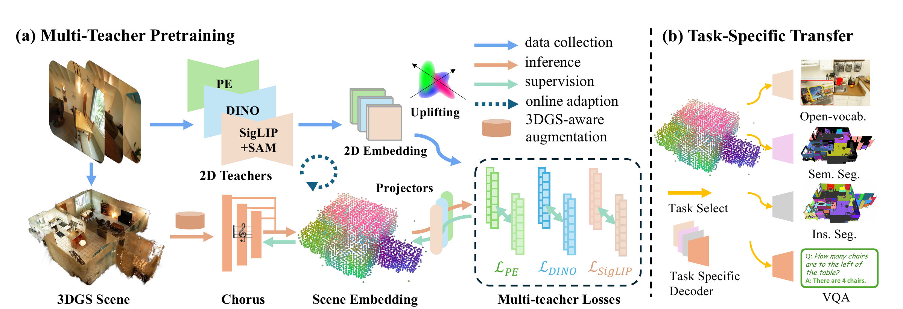

这篇笔记整理的是 [*Chorus: Multi-Teacher Pretraining for Holistic 3D Gaussian Scene Encoding*](https://arxiv.org/abs/2512.17817v3)。Chorus 输入已经重建好的 3DGS，为每个高斯提取场景理解特征。这里的 **feedforward 指特征编码**，上游的 3DGS 重建仍需另外完成。

方法的核心是多教师蒸馏：先将二维模型的语义和结构知识提升到高斯上，作为训练目标；再训练一个共享的三维编码器，仅根据高斯参数预测这些特征。遇到新场景时，直接运行编码器即可，不再逐场景处理多视图教师特征。

*图来自论文 Figure 2。上方是教师监督的制作路径，下方是高斯编码路径；右侧展示特征接入不同任务的方式。*

## 输入与输出

输入场景由 $N$ 个高斯组成：

$$
\mathcal G=\{(x_i,s_i,q_i,\alpha_i,c_i)\}_{i=1}^{N},
$$

分别表示中心、三轴尺度、旋转四元数、不透明度和 RGB 颜色。共享编码器输出空间特征 $Z=g_\theta(\mathcal G)$，各投影头再将它映射到对应教师的特征空间：

$$
\hat f_i^{(t)}=h_t(z_i).
$$

$Z$ 保留逐元素的空间对应关系，可供下游任务使用；$\hat f_i^{(t)}$ 用于教师特征匹配，例如语言分支可以与文本特征比较。网络在这里学习语义表示，不更新高斯的几何与颜色。

## 先把二维教师特征提升到高斯上

预训练使用三类互补的监督：

| 分支 | 教师 | 特征维度 | 侧重点 |
| --- | --- | ---: | --- |
| 语言 | SigLIP2-so400m-p16-512 | 1152 | 文本可对齐的语义 |
| 通用视觉 | DINOv3-ViT-L/16 | 1024 | 视觉结构与局部对应 |
| 物体感知 | PE-Spatial-L14-448 | 1024 | 物体、部件与局部空间结构 |

对构建 3DGS 时使用的 RGB 帧离线提取教师特征，并将特征图插值到渲染图像尺寸。语言分支沿用 SceneSplat 的 SigLIP2 与 SAM2 联合处理流程；SAM2 帮助构建稠密语义特征，没有单独的蒸馏头。

接着利用高斯渲染权重建立二维与三维的对应。对视图 $p$ 中的像素 $u$，高斯 $i$ 的贡献为：

$$
w_i(p,u)=T_i(p,u)\alpha_i(u\mid p),\qquad
T_i(p,u)=\prod_{j<i}\big(1-\alpha_j(u\mid p)\big).
$$

其中 $\alpha_i(u\mid p)$ 包含高斯在该像素上的投影足迹，$T_i$ 则考虑前方高斯的遮挡。对同一个高斯，累积它在所有相关视图、像素中的教师特征，再除以总贡献：

$$
f_i^{(t)}=
\frac{\sum_{(p,u)\in S_i}w_i(p,u)F_{p,u}^{(t)}}
{\sum_{(p,u)\in S_i}w_i(p,u)}.
$$

这一步称为 **normalized uplifting**。它考虑一个 splat 覆盖的多个像素及多个视角，并按实际渲染贡献聚合，清晰可见的观测权重更大。得到的逐高斯特征是离线训练目标；可见性不足或特征无效的位置通过掩码跳过监督。

## 三维编码器如何处理高斯

论文采用 Sonata 的五级 Transformer 编码器。

### 属性嵌入与分层编码

坐标 $x_i$ 单独用于网格化和空间运算，其余属性拼成 11 维输入 $[c_i,\alpha_i,q_i,s_i]$，通过线性层、LayerNorm 和 GELU 映射到 48 维，再进入五级 PTv3 编码器：

| 阶段 | 特征维度 | Transformer block 数 |
| --- | ---: | ---: |
| 1 | 48 | 3 |
| 2 | 96 | 3 |
| 3 | 192 | 3 |
| 4 | 384 | 12 |
| 5 | 512 | 3 |

每个 block 先用稀疏三维卷积引入局部位置信息，再做序列化注意力和 MLP 变换，各部分带残差连接。序列化注意力按 Z-order、Hilbert 等空间顺序组织元素，在 patch 内计算，配置中的 patch 大小为 1024。

级间通过 GridPooling 聚合：将网格尺度翻倍，把同一粗网格内的特征线性投影后做 max 聚合，中心取均值。这样逐级减少空间元素，扩大上下文范围，同时保存细元素到粗元素的逆索引。

### 从 512 维瓶颈恢复逐高斯特征

最后一级是较粗空间分辨率的 512 维 token。为了得到逐元素输出，代码沿池化层级回溯，将粗级特征按逆索引广播回细级，再与细级已有特征拼接：

$$
U_5=F_5,\qquad
U_s=\operatorname{Concat}\big(F_s,U_{s+1}[\mathrm{inverse}_{s+1}]\big).
$$

五级特征合并后的宽度为：

$$
48+96+192+384+512=1232.
$$

因此，**512 维是末级瓶颈，1232 维才是蒸馏投影头接收的逐元素共享特征**。这一步依靠索引回填与拼接，没有启用完整的可学习 Transformer 解码器。若输入经过网格采样，外层推理程序还会将结果映射回原始高斯。

三个投影头分别接收同一份共享特征，结构均为 LayerNorm、线性层、GELU、线性层，维度为 $1232\to4928\to d_t$。教师的维度和表示差异由各自的头处理，损失则共同更新骨干。

## 怎样训练共享表示

每个分支用余弦距离和 SmoothL1 匹配教师目标：

$$
\mathcal L_{\mathrm{match}}^{(t)}=
\frac{1}{|M_t|}\sum_{i\in M_t}
\left[
\lambda_1\big(1-\cos(\hat f_i^{(t)},\tilde f_i^{(t)})\big)
+\lambda_2\operatorname{SmoothL1}(\hat f_i^{(t)},\tilde f_i^{(t)})
\right].
$$

$M_t$ 是有效高斯集合。余弦项约束方向，SmoothL1 提供数值匹配约束。论文还引入 PHI-S 均衡不同教师的特征分布，减轻数值尺度差异对损失权重的影响。

有类别或实例标签时，再加入组级对比损失。语言分支按类别分组，PE 分支按实例分组；每组随机拆成两半，分别平均预测特征。同组两半作为正对，其他组作为负对，计算双向 InfoNCE。这样，语言分支强调“都是椅子”，实例分支同时保留“这是两把不同的椅子”的区分能力。这个对比项需要分组标签，是基础蒸馏之外的可选监督。

训练前期使用 SigLIP2 和 DINO，后半段再加入 PE-Spatial；各分支的对比项在投影头 warm-up 后启用。作者认为，过早加入 PE 容易让网络过度依附局部特征，后期加入更适合细化空间结构。总损失为各分支匹配项与对比项的加权和，论文采用相同教师权重，对比项系数为 0.02。

## 新场景如何前馈推理

新场景只需读取高斯参数，完成预处理后运行五级编码器，回填多尺度特征，再接所需投影头或任务模块。网络参数固定，无需为当前场景重新运行图像教师或优化语义向量。大场景可以分片推理后聚合结果，feedforward 并不要求整场景在软件中恰好只调用一次网络。

开放词汇查询使用语言头输出，与相应文本编码器的特征计算余弦相似度。语义分割可以在共享特征上训练线性层或任务解码器。论文的开放词汇实例分割还使用 Mask3D 提供实例 proposals；问答则将三维 token 经连接器送给语言模型。

问答实验使用的是最后一级的 512 维特征，而非蒸馏投影头前的 1232 维拼接特征。作者另行预训练了只输入中心、颜色和估计法向的点云兼容版本，用相同教师监督迁移到点云任务。

## 新域适配：把预测特征渲染回二维

对新数据域继续预计算逐高斯教师目标，会增加特征处理和存储开销。Chorus 提供在线 render-and-distill 适配：一条路径将高斯渲染为 RGB，交给冻结的二维教师；另一条路径运行 Chorus，得到逐高斯预测特征，再用相同的 alpha 合成权重渲染为特征图：

$$
\hat F_{p,u}^{(t)}=\sum_iw_i(p,u)\hat f_i^{(t)}.
$$

两张特征图在有效像素上计算余弦与 SmoothL1 损失，梯度通过特征渲染回传给编码网络。这里直接使用渲染加权和，与离线 uplifting 中跨视图归一化的方向不同。

训练时优先选择有较大重叠的视图，合并它们对应的场景区域，编码一次后接受多个视角监督。为避免裁剪破坏桌椅等三维结构，作者在可见区域包围框外增加 0.2 m 余量。默认使用 4 个视图，RGB 渲染尺寸为 $480\times640$，特征渲染尺寸为 $120\times160$，教师特征插值到后者。

这是额外的网络微调流程，普通新场景推理不必执行。已有 3DGS 始终提供几何和渲染载体。

## 两种高斯增强

高斯参数来自渲染优化，随意加入位置噪声可能破坏原本共同表达表面的 splat。论文为此设计了两种增强。

**Rendering-equivalent perturbation** 主要移动低不透明度高斯。由尺度和旋转构造协方差 $\Sigma_i$，对中心加入 $\eta w(\alpha_i)\Sigma_i\xi_i$，其中 $\xi_i$ 为标准高斯噪声，$w$ 在低不透明度时较大。扰动沿椭球形状调制，尽量少改变贡献大的高斯，从而近似保留外观。原文使用的是 $\Sigma_i\xi_i$，不是协方差平方根。

**Immature-manifold perturbation** 优先放大小高斯的尺度，让投影足迹变宽、细节变模糊，模拟 3DGS 优化较早时的状态。训练要求这些参数变化仍能得到稳定特征，使编码器适应不同重建质量与优化成熟度。
