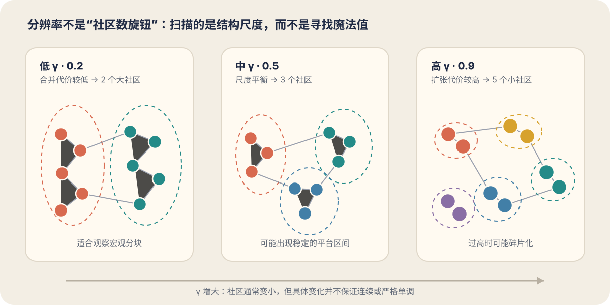
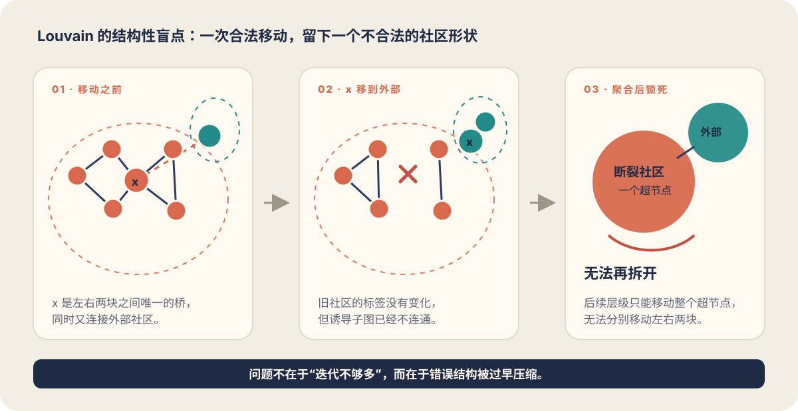
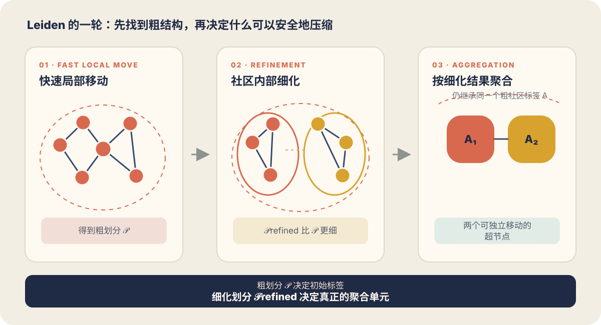

---

title: 'Leiden 社区发现算法学习笔记'
date: 2026-08-12
summary: 'From Louvain to Leiden.'

series: 'algorithm'

tags: ['Leiden', 'Community Detection', 'Graph Algorithm', 'Network Science']

cover: ../../assets/blogs/leiden-network-landscape.png
coverAlt: '一张混杂的节点网络逐渐演化为三个内部连通、彼此分离的社区'

draft: false
---

社区发现（community detection）的目标，是把网络中的节点划分成若干组，使同一组内部的连接相对紧密、不同组之间的连接相对稀疏。社交网络中的朋友圈、引文网络中的研究方向、生物网络中的功能模块和知识图谱中的主题群，都可以用这个视角分析。

Leiden 算法由 Traag、Waltman 和 van Eck 于 2019 年提出。它可以看作 Louvain 的重要改进：两者都通过局部优化和图聚合来增大某个划分质量函数，但 Leiden 在二者之间加入了关键的**细化（refinement）阶段**。这个阶段让算法在压缩网络以前先检查社区内部结构，避免把不连通或连接很差的节点集合永久锁进同一个超节点。

## 目录 <!-- omit from toc -->

- [1. 建立正确的直觉](#1-建立正确的直觉)
- [2. 划分质量衡量](#2-划分质量衡量)
- [3. 从 Louvain 的缺陷说起](#3-从-louvain-的缺陷说起)
- [4. Leiden 算法的三个阶段](#4-leiden-算法的三个阶段)
- [5. 用两个三角形走完一轮](#5-用两个三角形走完一轮)
- [6. Leiden 算法的特性](#6-leiden-算法的特性)
- [7. Leiden、Louvain 与标签传播的对比](#7-leidenlouvain-与标签传播的对比)
- [8. Python 实现](#8-python-实现)
- [9. 从向量到 Leiden：建图的质量往往更重要](#9-从向量到-leiden建图的质量往往更重要)
- [参考资料](#参考资料)

## 1. 建立正确的直觉

设想下面两组节点：每组内部都有很多边，两组之间只有一条边。人眼通常会自然地把它们看成两个社区。算法要做的事情，是把这种视觉直觉变成一个能够计算、比较和优化的目标。

但内部边多这种描述仍不够精确。一个拥有 100 条内部边的 1000 节点群体，可能比一个拥有 10 条内部边的 5 节点群体稀疏得多；一个高度节点本来就会产生很多连接，也不能仅因为它在某个集合中有很多边，就断言这个集合是社区。

因此，社区发现通常需要同时考虑：

- 社区内部实际存在多少连接；
- 社区规模有多大；
- 节点本身的度有多高；
- 某些连接在随机基线下是否本就很容易出现；
- 观察的是宏观群体还是更细的局部结构。

### 1.1 输入是图，不是样本矩阵

给定无向加权图

$$
G=(V,E),
$$

其中 $V$ 是节点集合，$E$ 是边集合，$A_{ij}$ 表示节点 $i$ 与 $j$ 之间的边权。Leiden 直接使用的是这些节点和边。

如果原始数据是向量，例如单细胞表达矩阵或文本 embedding，典型流程其实是：

$$
\text{向量数据}
\longrightarrow
\text{距离或相似度}
\longrightarrow
k\text{NN 图}
\longrightarrow
\text{Leiden 划分}.
$$

这意味着最终结果不仅由 Leiden 决定，还受距离度量、近邻数 $k$、边权定义、是否使用 mutual kNN、是否剪枝以及上游降维方法影响。

### 1.2 输出是划分，不是唯一真值

算法输出一个划分

$$
\mathcal{P}=\{C_1,C_2,\ldots,C_K\},
$$

满足不同社区互不相交，并且所有社区覆盖全部节点：

$$
C_a\cap C_b=\varnothing\quad(a\ne b),
\qquad
\bigcup_{C\in\mathcal{P}}C=V.
$$

标准 Leiden 因而具有三个基本特点：

- **无监督**：不依赖训练标签；
- **硬划分**：每个节点只属于一个社区；
- **社区数量通常不预设**：$K$ 由图、目标函数和分辨率共同决定。

社区并没有脱离模型的唯一标准答案。更准确地说，Leiden 是在给定图和质量函数以后，寻找一个高质量的局部最优划分，而不是读取隐藏在数据里的唯一真值。

## 2. 划分质量衡量

Leiden 是一套**优化过程**，并不等于某个特定目标函数。算法需要一个质量分数

$$
Q(\mathcal{P})
$$

来判断一次节点移动或子社区合并是否让结果变好。最常见的选择是 Modularity 和 Constant Potts Model（CPM）。

### 2.1 Modularity：相对随机基线多出了多少内部连接

先定义：

- $A_{ij}$：节点 $i,j$ 之间的边权；
- $k_i=\sum_jA_{ij}$：节点 $i$ 的加权度；
- $m=\frac12\sum_{ij}A_{ij}$：图中总边权，每条无向边只计算一次；
- $c_i$：节点 $i$ 所属社区；
- $\delta(c_i,c_j)$：两节点属于同一社区时为 1，否则为 0。

带分辨率参数 $\gamma$ 的 Modularity 可以写成

$$
Q=\frac{1}{2m}\sum_{ij}
\left(
A_{ij}-\gamma\frac{k_i k_j}{2m}
\right)
\delta(c_i,c_j).
$$

括号里有两项：

$$
\underbrace{A_{ij}}_{\text{真实连接}}
- \underbrace{\gamma\frac{k_i k_j}{2m}}_{\text{随机基线中的期望连接}}.
$$

随机基线通常对应保持节点度数的配置模型。若两个节点的度都很高，它们在随机网络中相连的机会本来就大；只有真实连接超过这种预期，把它们放在同一社区才会得到明显奖励。

Modularity 也可以按社区求和。令 $m_C$ 为社区 $C$ 的内部边权之和，每条内部边只计算一次；令 $K_C=\sum_{i\in C}k_i$ 为社区总度，则

$$
Q=\sum_{C\in\mathcal P}
\left[
\frac{m_C}{m} - \gamma\left(\frac{K_C}{2m}\right)^2
\right].
$$

这种写法更容易看出：第一项奖励内部连接，第二项惩罚在随机基线下本来就会拥有很多内部边的大体量社区。

Modularity 的经典问题是**分辨率极限（resolution limit）**：网络足够大时，一些本身结构清晰的小社区仍可能被合并。Leiden 修复的是 Louvain 的搜索和内部连通性问题，并不会自动消除 Modularity 目标函数自身的分辨率极限。

### 2.2 CPM：奖励内部边，同时惩罚社区膨胀

对于无权无向图，CPM 常写成

$$
Q_{\mathrm{CPM}}
=\sum_{C\in\mathcal P}
\left[
m_C-\gamma\binom{n_C}{2}
\right],
$$

其中：

- $m_C$ 是社区内部边数；
- $n_C$ 是社区节点数；
- $\binom{n_C}{2}$ 是这些节点之间最多可能存在的边数；
- $\gamma$ 是分辨率或密度尺度。

CPM 的含义很直接：

$$
\underbrace{m_C}_{\text{奖励内部边}}
- \underbrace{\gamma\binom{n_C}{2}}_{\text{惩罚规模膨胀}}.
$$

如果把两个社区 $A,B$ 合并，质量变化为

$$
\Delta Q_{A\cup B}
=m_{AB}-\gamma n_A n_B,
$$

其中 $m_{AB}$ 是 $A,B$ 之间的边数。只有当两社区之间的连接密度

$$
\frac{m_{AB}}{n_A n_B}
$$

高于 $\gamma$ 时，合并才有正收益。反过来，一个稳定社区内部的连接密度倾向于不低于 $\gamma$，不同社区之间的连接密度倾向于不高于 $\gamma$。这使 CPM 的分辨率比 Modularity 更容易从密度角度解释。

CPM 不依赖整张图规模来定义随机基线，因此在相应定义下不会受到标准 Modularity 同样的全局分辨率极限。但这不意味着它不需要调参，也不意味着任何数据集都能共用同一个 $\gamma$。

### 2.3 手算 CPM

考虑四个节点，边集合为

$$
E=\{(1,2),(1,3),(2,3),(3,4)\}.
$$

节点 $1,2,3$ 构成一个三角形，节点 4 只通过一条边连接节点 3。取 $\gamma=0.5$。

如果四个节点全放在一起，社区中有 4 条边：

$$
Q_{\text{all}}
=4-0.5\binom42
=4-3
=1.
$$

如果划分成 $\{1,2,3\}$ 与 $\{4\}$：

$$
Q_{\text{split}}
=\left(3-0.5\binom32\right)+0
=3-1.5
=1.5.
$$

因此分开更好。也可以只计算把节点 4 加入三角形社区的增益：

$$
\Delta Q
=\underbrace{1}_{\text{新增内部边}}
- \underbrace{0.5\times3}_{\text{新增三个潜在节点对的惩罚}}
=-0.5.
$$

如果改为 $\gamma=0.3$，则

$$
\Delta Q=1-0.3\times3=0.1>0,
$$

此时把四个节点合并反而更好。这个小例子已经完整展示了分辨率控制社区尺度的机制。

### 2.4 节点移动时怎样计算增益

实际实现不会为每个候选移动重新计算整张图的 $Q$，而是只维护社区统计量并计算局部差值。

对 CPM，设节点 $i$ 当前在社区 $A$，准备移动到社区 $B$。记：

- $k_{i,B}$：$i$ 与 $B$ 内节点之间的总边权；
- $k_{i,A\setminus i}$：$i$ 与原社区中其他节点之间的总边权；
- $n_A,n_B$：移动前两个社区的节点数。

则

$$
\Delta Q_{i:A\to B} =
\left[k_{i,B}-\gamma n_B\right]
- \left[k_{i,A\setminus i}-\gamma(n_A-1)\right].
$$

第一组括号是加入 $B$ 的收益，第二组括号是留在 $A$ 所贡献的收益。节点与目标社区连接越强，越倾向于加入；目标社区越大，加入所承担的规模惩罚越高。

对 Modularity，使用上一节的社区求和形式，可以得到

$$
\Delta Q_{i:A\to B}
=\frac{k_{i,B}-k_{i,A\setminus i}}{m}
-\gamma\frac{k_i(K_B-K_A+k_i)}{2m^2},
$$

这里 $K_A,K_B$ 是移动前的社区总度。工程实现常先把 $i$ 从原社区临时移除，再比较把它插入不同候选社区的增益；这样公式和缓存更新会更简单。

一次移动通常只需枚举节点邻居涉及的社区，而不是枚举所有社区。把邻居边权按社区累加后，就能快速比较候选增益。

### 2.5 分辨率参数并不是社区数量



一般而言：

- $\gamma$ 较小：社区扩张的惩罚较弱，容易得到较少、较大的社区；
- $\gamma$ 较大：社区扩张的惩罚较强，容易得到较多、较小的社区。

但 $\gamma$ 不是 K-means 中的 $K$：它不能直接指定社区数，社区数量对 $\gamma$ 的响应也不保证连续或严格单调。

更重要的是，改变 $\gamma$ 就改变了优化问题本身。因此不能把不同 $\gamma$ 下的原始 $Q$ 值直接横向比较，再简单选择分数最高的一个。更可靠的做法是观察：

- 哪些社区在一段 $\gamma$ 区间内持续存在；
- 多个随机种子下划分是否稳定；
- 社区规模是否符合问题尺度；
- 结果是否具有领域解释。

## 3. 从 Louvain 的缺陷说起

理解 Leiden 最好的方式是先看 Louvain 为什么会卡住。

### 3.1 Louvain 的两个阶段

Louvain 通常从每个节点独占一个社区开始，并反复执行：

1. **局部移动**：依次访问节点，把节点移动到能够带来最大正增益的邻近社区；反复扫描，直到没有单节点移动可以继续提高质量；
2. **图聚合**：把当前每个社区压成一个超节点。社区内部边变成自环，社区之间的边权相加，形成超节点之间的边。

聚合后再在更小的图上重复这两个阶段。由于一个超节点代表原图中的整组节点，在聚合图中移动一个节点，等价于在原图中整体移动一个社区。这就是 Louvain 能高效发现多层次结构的原因。

### 3.2 桥节点如何撕裂一个社区



假设一个社区由左右两个稠密子群组成，中间只有节点 $x$ 充当桥。节点 $x$ 还与某个外部社区有较强连接。

如果把 $x$ 移到外部社区能够提高质量函数，Louvain 会接受这个移动。移动以后：

- 旧社区的左右两块已经不连通；
- 但左右两块内部的单个节点可能仍然都不愿离开旧标签；
- 拆分整个社区会提高质量，却无法通过一系列单节点正增益移动实现。

这里出现了一个重要区别：

- **节点局部最优**只表示没有单个节点值得移动；
- **社区内部结构合理**要求社区不能由彼此断开或连接极弱的子集拼成。

前者不能推出后者。

### 3.3 为什么继续迭代也不一定修得好

当不连通社区被压成一个超节点后，后续层级只能整体移动它，无法分别移动左右两块。错误结构因此被焊死。除非这个超节点偶然与其他结构合并后重新获得连接，否则算法没有直接拆开的机制。

重复运行 Louvain 甚至可能进一步暴露这个问题：新一轮单节点移动又可能把充当桥的节点移走，而算法仍然没有负责修复旧社区的阶段。

简单地把输出社区事后切成连通分量，也只解决了最极端的不连通情况。一个社区可能仍然只靠一条很脆弱的边连接，却在普通连通性检查中通过。Leiden 的目标不是做一次事后修补，而是在优化与聚合过程中系统地维护更强的内部连接性质。

## 4. Leiden 算法的三个阶段

一轮 Leiden 包括：快速局部移动、划分细化和基于细化结果的聚合。



为了避免概念混乱，先区分两个划分：

- $\mathcal P$：局部移动后得到的**粗划分**；
- $\mathcal P_{\mathrm{refined}}$：在粗社区内部重新组织后得到的**细化划分**。

细化划分只会拆分粗社区，不会跨越粗社区边界，因此

$$
\mathcal P_{\mathrm{refined}}\preceq\mathcal P.
$$

### 4.1 阶段一：快速局部移动

Leiden 的第一次节点访问与 Louvain 很相似，但它采用更高效的队列策略：

1. 以随机顺序把全部节点加入队列；
2. 从队首取出节点 $v$；
3. 暂时从当前社区移除 $v$，统计它与各候选社区的连接；
4. 若存在正增益移动，就把 $v$ 放入最佳候选社区；
5. 移动发生后，把邻域状态可能受到影响、且尚未在队列中的邻居重新入队；
6. 队列为空时停止。

远处节点的邻域和相关社区统计量没有变化，它们刚才不能移动，现在通常仍然不能移动，所以只需要重新检查受影响的邻居。Louvain 式的全图反复扫描会花很多时间重新验证这些没有变化的节点。

这个阶段结束后得到粗划分 $\mathcal P$。它提高了目标函数，但此时还不能直接把每个粗社区压成一个超节点。

### 4.2 阶段二：受约束的划分细化

细化阶段是对粗划分 $\mathcal P$ 中的每个社区 $C$，算法大致执行：

1. 在 $C$ 内部重新从单节点划分开始；
2. 只允许节点与 $C$ 内部的细化子社区合并，不能跨越粗社区边界；
3. 只考虑满足连接条件、并且不会降低质量函数的合并；
4. 从可行的正增益候选中进行带权随机选择，增益越大，通常越容易被选中；
5. 处理完所有粗社区，得到 $\mathcal P_{\mathrm{refined}}$。

这里有三个值得单独理解的细节。

**第一，细化从单节点状态重新开始。**

它不是沿用粗社区内部已有的不可拆结构，而是重新决定哪些节点可以安全地绑在一起。这就为拆开错误合并提供了入口。

**第二，细化受到粗社区边界约束。**

这一阶段负责检查一个粗社区内部的组织，不负责在不同粗社区之间重新竞争。跨社区移动仍由局部移动阶段处理。

**第三，它不是简单的贪心最大增益合并。**

原始算法会从所有可接受候选中随机选择，并让更高增益候选具有更高概率。可以把选择概率直观地理解为与

$$
\exp\left(\frac{\Delta Q}{\theta}\right)
$$

相关，其中 $\theta>0$ 控制随机程度。这样比每次只选眼前最大增益探索更多划分路径，但仍不接受降低目标的合并，因此不同于模拟退火。

细化也不仅是求每个粗社区的连通分量。普通连通只要求任意两点之间存在路径；Leiden 还通过质量函数和连接条件排除仅靠脆弱结构勉强连接的组合。

### 4.3 阶段三：按细化结果聚合

Leiden 按 $\mathcal P_{\mathrm{refined}}$ 构造聚合图：

- 每个细化子社区成为一个超节点；
- 子社区内部边成为自环；
- 两个子社区之间的所有边权相加；
- 超节点大小记录其代表的原始节点数量或节点权重。

假设粗社区 $C$ 被细化为 $C_1,C_2$。聚合以后，$C_1,C_2$ 是两个不同超节点，但它们在聚合图的**初始划分**中仍都带有粗社区标签 $C$。

**细化划分决定哪些节点被真正压在一起；粗划分决定这些超节点下一层从什么社区标签开始。**

算法记得 $C_1,C_2$ 当前属于同一个粗社区，却没有把它们永久焊死。下一层局部移动仍可分别移动两个超节点，从而修正粗阶段的错误。

正确聚合还应保持目标值不变：原图上某个划分的质量，应等于聚合图上对应划分的质量。自环、超节点大小和边权累加正是为保存这些统计量。

### 4.4 伪代码

忽略原始节点与不同聚合层之间的索引映射，框架可以写成：

```text
Leiden(G, P):
    # P 可以是单节点划分，也可以是已有初始划分
    repeat over aggregation levels:
        P_coarse <- FastLocalMove(G, P)

        # 每个粗社区内部，从单节点状态重新细化
        P_refined <- SingletonPartition(G)
        for each community C in P_coarse:
            RefineInside(C, P_refined, constrained_by=P_coarse)

        # 聚合单元来自细化划分
        G_new <- AggregateGraph(G, P_refined)

        # 聚合图上的初始标签来自粗划分
        P_new <- ProjectCoarseLabels(P_coarse, P_refined)

        G <- G_new
        P <- P_new
    until 图不能进一步有效缩小或质量不再提升

    return partition mapped back to original nodes
```

快速局部移动的核心队列可以写成：

```text
queue <- all nodes in random order

while queue is not empty:
    v <- pop_front(queue)
    target <- best neighbouring community with positive gain

    if target exists:
        move v to target
        for each affected neighbour u of v:
            if u is not already queued:
                push_back(queue, u)
```

具体实现还会维护社区总度、内部边权、节点大小、成员映射和候选社区缓存，以避免频繁遍历整张图。

## 5. 用两个三角形走完一轮

考虑两个三角形，仅由一条弱边相连：

```text
A ----- B             D ----- E
 \     /               \     /
   C --------(弱边)------ F
```

假设在当前目标函数和分辨率下，理想划分是

$$
\{A,B,C\},\qquad \{D,E,F\}.
$$

一轮 Leiden 可以这样理解：

1. **局部移动**：从单节点划分开始，三角形内部的合并有较大正增益，节点逐渐形成两个小团体；
2. **粗划分可能犯错**：受访问顺序和局部增益影响，弱边两侧可能暂时获得相同粗社区标签；
3. **内部细化**：在这个粗社区内部重新从单节点状态合并。两个三角形内部合并收益高，跨弱边合并收益不足，于是保留为两个细化子社区；
4. **聚合**：两个三角形分别变成超节点，初始标签可能仍相同；
5. **下一层局部移动**：两个超节点可以分别竞争。若拆开能提高目标，它们不再被强制绑定；
6. **映射回原图**：得到两个连通社区。

## 6. Leiden 算法的特性

在论文讨论的 CPM 或 Modularity 等设定下，Leiden 的保证会随迭代逐步增强：

| 时机 | 性质 | 直观含义 |
| --- | --- | --- |
| 每次迭代之后 | $\gamma$-separated | 任意两个现有社区不能通过直接合并继续改善目标 |
| 每次迭代之后 | $\gamma$-connected | 社区满足比普通连通更强的内部连接条件，因此至少内部连通 |
| 稳定迭代之后 | node optimal | 没有任何单节点能够通过换社区提高目标 |
| 稳定迭代之后 | subpartition $\gamma$-dense | 社区可递归分成彼此充分连接的子部分 |
| 渐近稳定之后 | uniformly $\gamma$-dense | 社区内不存在可以从其余部分有利分离的子集 |
| 渐近稳定之后 | subset optimal | 社区中任意节点子集都无法通过重新分配改善目标 |

其中，subset optimality 是最强的性质，并蕴含前面的多种连接和局部最优性质。

此外，需要明确的是：

- **保证连通不等于最大化了全局最优值**；
- **局部或子集最优不等于划分唯一**；
- **拓扑合理不等于社区具有业务语义**。

Leiden 仍是启发式优化算法。不同随机种子、不同初始划分以及近似相同的目标值，都可能对应结构不同的高质量划分。

## 7. Leiden、Louvain 与标签传播的对比

| 方法 | 核心机制 | 主要优点 | 主要局限 |
| --- | --- | --- | --- |
| Louvain | 单节点局部移动 + 社区聚合 | 简单、快速、易扩展 | 可能输出内部不连通或连接很差的社区，聚合后难以拆开 |
| Leiden | 快速局部移动 + 细化 + 聚合 | 保证社区连通，通常能找到更高质量划分，并减少无效扫描 | 仍依赖目标函数、参数、图构造和随机性 |
| Label Propagation | 节点采用邻居中的主流标签 | 计算开销低，不必显式优化 Modularity | 结果可能高度不稳定，社区尺度不易控制 |

## 8. Python 实现

Python 中常用 [`igraph`](https://python.igraph.org/) 与 [`leidenalg`](https://leidenalg.readthedocs.io/)：

```bash
pip install igraph leidenalg
```

后面的参数扫描示例还使用 `pandas`，稳定性示例使用 `scikit-learn`；需要运行相应代码时可以额外安装：

```bash
pip install pandas scikit-learn
```

## 9. 从向量到 Leiden：建图的质量往往更重要

在单细胞和 embedding 聚类中，Leiden 经常被描述成聚类算法，但它实际优化的是近邻图。假设原始数据为 $x_1,\ldots,x_n$，常见建图流程包括：

1. 标准化或降维；
2. 选择距离，例如欧氏距离、余弦距离或相关距离；
3. 为每个样本寻找 $k$ 个近邻；
4. 决定有向 kNN 如何对称化；
5. 把距离转换为相似度或连接权；
6. 对图进行剪枝或构造共享近邻（SNN）权重；
7. 在所得图上运行 Leiden。

几个参数会产生不同类型的影响：

- **$k$ 太小**：图可能碎裂，局部噪声被放大，出现大量小社区；
- **$k$ 太大**：远距离节点被连接，局部结构被抹平；
- **权重过于尖锐**：少数最近邻支配结果；
- **权重过于平坦**：强连接和弱连接难以区分；
- **降维丢失结构**：Leiden 无法从后续图中恢复已经被删除的信息。

所以参数实验最好分两层进行：

$$
(k,\ \text{距离},\ \text{权重规则})
\quad\times\quad
(\text{目标函数},\ \gamma,\ \text{seed}).
$$

只扫描 Leiden 的 `resolution_parameter`，却把上游图固定为未经验证的版本，容易把建图偏差误判成社区尺度问题。

## 参考资料

1. V. A. Traag, L. Waltman, N. J. van Eck, [From Louvain to Leiden: guaranteeing well-connected communities](https://doi.org/10.1038/s41598-019-41695-z), *Scientific Reports*, 2019.
2. V. D. Blondel, J.-L. Guillaume, R. Lambiotte, E. Lefebvre, [Fast unfolding of communities in large networks](https://doi.org/10.1088/1742-5468/2008/10/P10008), *Journal of Statistical Mechanics*, 2008.
3. S. Fortunato, M. Barthélemy, [Resolution limit in community detection](https://doi.org/10.1073/pnas.0605965104), *PNAS*, 2007.
4. V. A. Traag, P. Van Dooren, Y. Nesterov, [Narrow scope for resolution-limit-free community detection](https://doi.org/10.1103/PhysRevE.84.016114), *Physical Review E*, 2011.
5. [`leidenalg` Python documentation](https://leidenalg.readthedocs.io/en/stable/).
6. [`igraph` Leiden reference](https://igraph.org/r/html/1.3.5/cluster_leiden.html).
