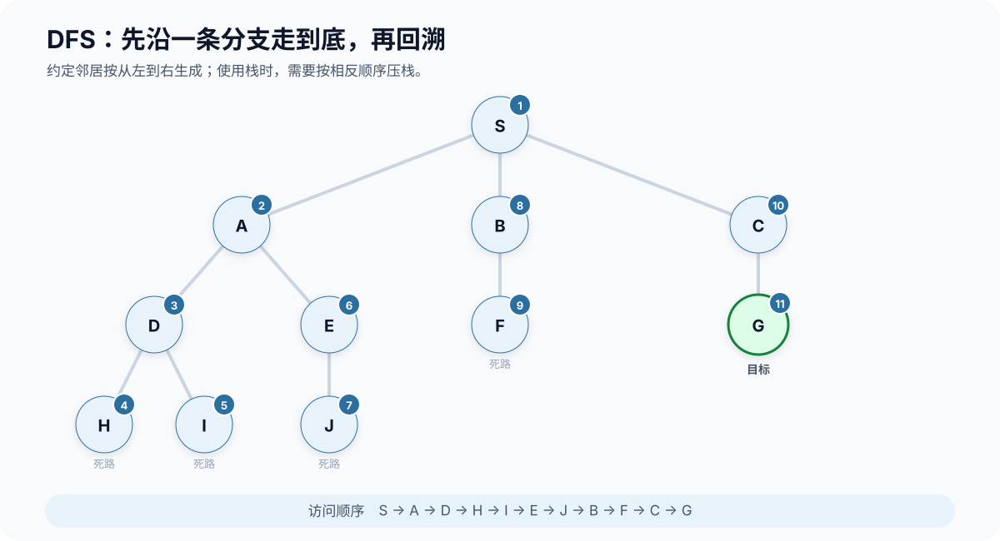
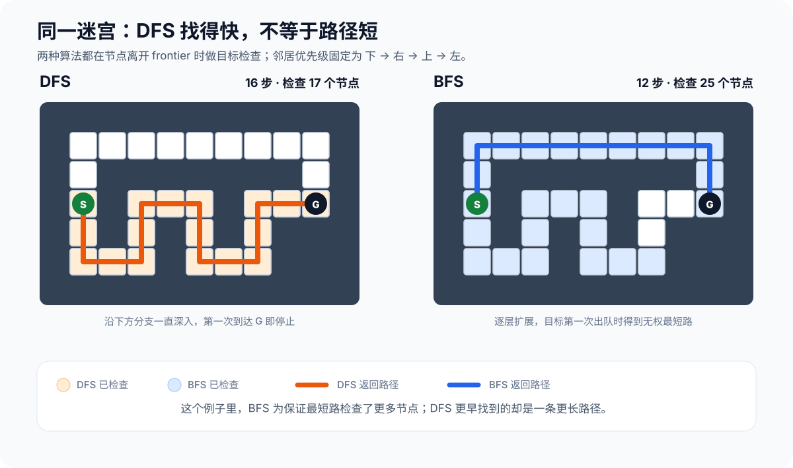
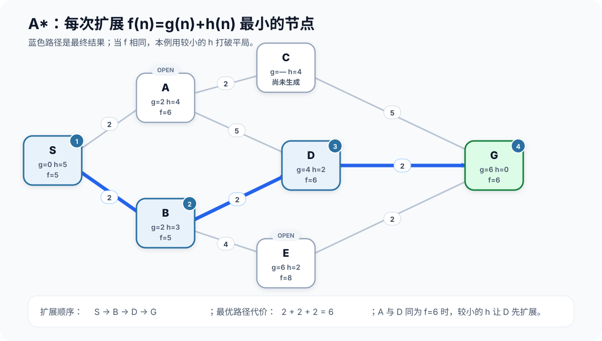
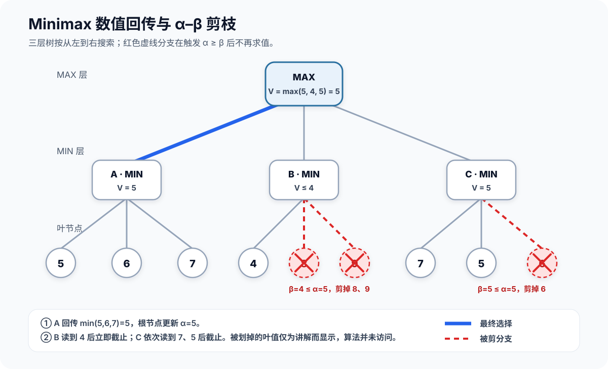
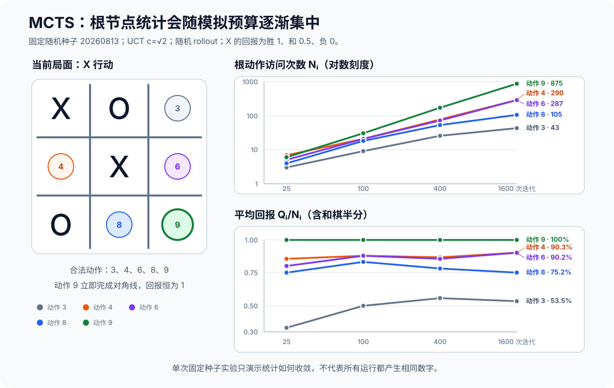

---

title: '前深度学期时代经典搜索算法'
date: 2026-07-15
summary: 'DFS, BFS, A*, Minimax and α–β pruning, Monte Carlo Tree Search.'

# Which series this belongs to. Must be one of the ids in `blogSeries`
# in src/data/site.ts. A typo here fails the build and names this file.
series: 'algorithm'

tags: ['Search']

cover: ../../assets/blogs/search-algorithms-cover.png
coverAlt: '迷宫路径逐渐展开为搜索前沿、启发式路线和带剪枝的博弈树'

# true = keeps the file but publishes nothing, not even the URL.
draft: false
---

搜索算法解决的核心问题可以概括为：**在一个由状态和转移构成的空间中，找到满足目标的状态或一条通往目标的路径**

迷宫寻路、地图导航、八数码、棋类博弈看起来差异很大，但都可以抽象成对一棵树或一张图的搜索。不同算法的主要区别，在于它们如何回答下面几个问题：

1. 接下来扩展哪个节点
2. 如何利用已经掌握的信息减少无效搜索
3. 何时停止，并相信当前答案足够好

本文依次整理五类经典算法：DFS、BFS、A*、Minimax + α–β 剪枝和蒙特卡洛树搜索（MCTS）。前两者是无信息搜索，A* 引入启发式知识，后两类则把搜索扩展到存在对手的决策问题中。

## 目录

- [1. 统一视角：状态空间搜索](#1-统一视角状态空间搜索)
- [2. 深度优先搜索 DFS](#2-深度优先搜索-dfs)
- [3. 广度优先搜索 BFS](#3-广度优先搜索-bfs)
- [4. 引入启发函数的搜索 A*](#4-用启发式函数引导搜索)
- [5. Minimax 与 α–β 剪枝](#5-minimax-与-αβ-剪枝)
- [6. 蒙特卡洛树搜索 MCTS](#6-蒙特卡洛树搜索-mcts)
- [7. 总结与待补充内容](#7-总结)

## 1. 统一视角：状态空间搜索

首先定义搜索问题中的几个基本元素：

- **状态（state）**：对当前局面的完整描述，例如迷宫中的坐标或棋盘布局。
- **初始状态（initial state）**：搜索开始的位置。
- **动作（action）**：在一个状态下允许执行的操作。
- **状态转移（transition）**：执行动作后如何得到下一个状态。
- **目标测试（goal test）**：判断当前状态是否满足目标。
- **路径代价（path cost）**：从起点到当前状态所付出的总代价。

搜索过程还会维护一个**集合**，其中存放已经发现但尚未扩展的节点。DFS、BFS 和 A* 的通用形式非常相似，真正决定算法行为的是选择从这个集合中取出哪个节点。

| 算法 | 集合结构 | 下一个扩展的节点 |
| --- | --- | --- |
| DFS | 栈 | 最晚加入的节点 |
| BFS | 队列 | 最早加入的节点 |
| A* | 优先队列 | $f(n)=g(n)+h(n)$ 最小的节点 |

### 树搜索与图搜索

同一个状态可能由不同路径到达。如果完全不记录访问历史，算法实际上在一棵搜索树上工作，可能反复搜索同一状态，甚至陷入环中。图搜索通常额外维护 `visited`、`closed` 或当前已知的最小代价，从而避免不必要的重复。

其次需要阐明两个概念：

- **搜索状态**是问题本身的状态，例如坐标 `(x, y)`。
- **搜索节点**除了状态，还可能保存父节点、深度、累计代价等搜索过程中的信息。

这个区别在 A* 中尤其重要，因为同一个状态可能被一条代价更低的新路径再次到达。

## 2. 深度优先搜索 DFS

深度优先搜索（Depth-First Search）会优先沿一条路径不断向下探索，直到无法继续，再回退到最近的分叉点。它可以用递归自然地实现，也可以显式维护一个栈。

### 2.1 基本思路

假设当前位于一个迷宫岔路口，DFS 会先选择其中一个方向一直走到底；如果遇到死路，就退回上一个岔路口尝试其他方向。这种策略只需要保存当前路径和少量尚未访问的分支，因此空间开销通常较小。

### 2.2 搜索顺序示例

下面的搜索树约定邻居按从左到右的顺序生成，并在节点入栈时标记访问。由于栈是后进先出结构，实际实现需要把邻居按相反顺序压栈，才能让最左侧的节点先被弹出。



图中的编号表示节点出栈并接受目标检查的顺序。DFS 先完整搜索 A 的子树，再回到 B、C；即使目标 G 的深度较浅，它仍然到第 11 次检查才被找到。改变邻居顺序会改变具体访问序列，但不会改变“先深入、后回溯”的基本行为。

### 2.3 伪代码

```python
def dfs(start):
    stack = [start]
    visited = {start}

    while stack:
        node = stack.pop()

        if is_goal(node):
            return reconstruct_path(node)

        for child in successors(node):
            if child not in visited:
                visited.add(child)       # 入栈时标记，避免重复入栈
                child.parent = node
                stack.append(child)

    return None
```

如果需要保证生成的路径与预期的邻居顺序一致，要注意栈的后进先出性质：邻居的入栈顺序与实际访问顺序相反。

### 2.4 性质与复杂度

用 $b$ 表示平均分支因子，$m$ 表示搜索树的最大深度：

- 时间复杂度最坏为 $O(b^m)$。
- 树搜索的空间复杂度约为 $O(bm)$，通常显著小于 BFS。
- DFS 找到的第一个解不一定是最短或代价最低的解。
- 在无限深的状态空间中，DFS 可能永远沿错误分支向下搜索。
- 在有限图上加入正确的去重机制后，DFS 能够遍历所有可达节点，此时时间复杂度为 $O(|V|+|E|)$。

### 2.5 适用场景

DFS 常用于：

- 图的连通性判断；
- 拓扑排序和环检测；
- 回溯问题，如排列、组合、数独和 N 皇后；
- 只关心是否存在解，而且内存比较有限的问题。

### 2.6 容易忽略的问题

1. **环**：在图上搜索时可能无限循环。
2. **过早标记或取消访问**：普通图遍历与回溯枚举对 `visited` 的语义不同。前者一般永久标记，后者可能需要在返回时撤销选择。
3. **把第一个解当作最优解**：普通 DFS 没有这一保证。

## 3. 广度优先搜索 BFS

广度优先搜索（Breadth-First Search）从起点开始逐层扩展：先访问所有距离为 1 的状态，再访问距离为 2 的状态，以此类推。

### 3.1 基本思路

可以把 BFS 想象成水波从起点向四周扩散。只要每一步的代价相同，目标第一次被发现时，对应的路径就是步数最少的路径。

### 3.2 伪代码

```python
from collections import deque

def bfs(start):
    queue = deque([start])
    visited = {start}

    while queue:
        node = queue.popleft()

        if is_goal(node):
            return reconstruct_path(node)

        for child in successors(node):
            if child not in visited:
                visited.add(child)       # 入队时标记，避免重复入队
                child.parent = node
                queue.append(child)

    return None
```

### 3.3 性质与复杂度

用 $d$ 表示最浅目标节点的深度：

- 在有限分支因子的前提下，BFS 是完备的，即存在解时最终能够找到解。
- 当每条边的代价相同时，BFS 找到的第一个解是最短路径。
- 按搜索树分析，时间和空间复杂度都为 $O(b^{d+1})$。
- 按显式图分析，时间复杂度为 $O(|V|+|E|)$，空间复杂度为 $O(|V|)$。

BFS 的主要瓶颈通常不是时间，而是保存整层节点带来的内存消耗。

### 3.4 BFS 与 DFS 的对比

| 对比项 | DFS | BFS |
| --- | --- | --- |
| 数据结构 | 栈 / 递归 | 队列 |
| 搜索顺序 | 优先向深处 | 逐层扩展 |
| 内存占用 | 通常较小 | 通常较大 |
| 无权最短路 | 不保证 | 保证 |
| 无限深空间 | 可能陷入深分支 | 有限分支时可找到浅层解 |

### 3.5 同一迷宫中的路径与扩展量

下面固定四方向移动的邻居优先级为“下、右、上、左”，在节点进入 frontier 时标记访问，并在节点离开 frontier 时做目标检查。图中的“检查节点数”包含起点与目标。



DFS 沿下方分支持续深入，较早到达目标，却返回了一条 16 步路径。BFS 同时向两条走廊逐层推进，检查了更多节点，最终返回上方的 12 步路径。这个结果并不矛盾：BFS 保证的是等代价边上的**路径最短**，而不是在每个实例中都扩展更少的节点。


## 4. 用启发式函数引导搜索

DFS 和 BFS 无法获知目标大概在哪个方向。A* 在累计路径代价之外，引入启发式函数来估计当前位置到目标的剩余代价。

对节点 $n$，A* 的评价函数为：

$$
f(n)=g(n)+h(n)
$$

其中：

- $g(n)$ 是从起点到节点 $n$ 的实际代价；
- $h(n)$ 是从节点 $n$ 到目标的估计代价；
- $f(n)$ 是经过节点 $n$ 到达目标的估计总代价。

每一步，A* 都从优先队列中选择 $f(n)$ 最小的节点进行扩展。

### 4.1 从 Dijkstra 到 A*

如果令 $h(n)=0$，A* 就退化为一致代价搜索；在非负权图上，这与 Dijkstra 算法的核心选择规则相同。如果只考虑 $h(n)$ 而忽略 $g(n)$，则接近贪心最佳优先搜索。

因此，可以把 A* 理解为两种倾向之间的平衡：

- $g(n)$ 让算法尊重已经付出的真实代价；
- $h(n)$ 让算法倾向于靠近目标。

### 4.2 启发式函数

启发式函数决定了 A* 的效率和最优性。常见的两个条件是：

**可采纳性（admissibility）**：启发式函数从不高估真实的最小剩余代价。

$$
0 \le h(n) \le h^*(n)
$$

其中 $h^*(n)$ 表示从 $n$ 到目标的真实最小代价。

**一致性（consistency）**：对于任意从 $n$ 到 $n'$、代价为 $c(n,n')$ 的转移，都满足：

$$
h(n) \le c(n,n') + h(n')
$$

一致性相当于启发式函数满足一种三角不等式。它能够保证沿路径的 $f$ 值不会下降。对采用 closed set 且不重新打开节点的常见图搜索实现，一致性是保证最优性的一个重要条件。

以四方向移动的网格为例，如果每次移动代价为 1，可以使用曼哈顿距离：

$$
h(n)=|x_n-x_{goal}|+|y_n-y_{goal}|
$$

### 4.3 带权图演示

下面的图在每个节点中标出当前的 $g$、启发值 $h$ 和评价值 $f$。启发函数不高估到目标的真实最小代价；当多个节点的 $f$ 相同时，本例用较小的 $h$ 打破平局。



扩展 S 后，B 的 $f=5$ 小于 A 的 $f=6$，因此先选择 B。B 生成 D 与 E；此时 A 和 D 的 $f$ 都是 6，较小的 $h$ 让 D 先被扩展。D 随后生成 $g=6$ 的目标 G，G 被弹出时搜索结束，得到路径 $S\rightarrow B\rightarrow D\rightarrow G$，总代价为 6。A、E 仍留在 OPEN 中，C 则尚未生成。

### 4.4 伪代码

```python
from heapq import heappop, heappush

def astar(start, goal):
    # 元素形式：(f, tie_breaker, node)
    open_heap = []
    heappush(open_heap, (heuristic(start, goal), 0, start))

    best_g = {start: 0}
    parent = {start: None}
    counter = 1

    while open_heap:
        f, _, node = heappop(open_heap)

        # 优先队列里可能保留同一状态的旧条目
        if f > best_g[node] + heuristic(node, goal):
            continue

        if node == goal:
            return reconstruct_path_from(parent, goal)

        for child, step_cost in successors(node):
            new_g = best_g[node] + step_cost

            if child not in best_g or new_g < best_g[child]:
                best_g[child] = new_g
                parent[child] = node
                new_f = new_g + heuristic(child, goal)
                heappush(open_heap, (new_f, counter, child))
                counter += 1

    return None
```

`tie_breaker` 用来避免两个 $f$ 值相同且节点对象不可比较时，堆继续比较节点本身。实际实现还需要明确是否维护 closed set，以及找到更短路径后是否允许重新打开节点。

### 4.5 性质与局限

- 在常见条件下，使用可采纳启发式的 A* 能找到最优解；图搜索的具体保证还取决于一致性和节点重开策略。
- 启发式越接近真实剩余代价，通常扩展的无关节点越少。
- 当 $h(n)=0$ 时，A* 不再获得方向信息。
- A* 最坏情况下仍可能扩展指数数量的节点。
- 与 BFS 类似，A* 通常需要保存大量候选节点，内存可能成为主要限制。

### 4.6 设计启发式函数的原则

1. 从问题的简化版本中推导一个容易计算的下界。
2. 在保证所需最优性的前提下，让估计尽量接近真实代价。
3. 同时考虑启发式函数本身的计算成本；更精确但极其昂贵的估计未必更快。
4. 明确需要的是严格最优解，还是更快得到一个足够好的解。


## 5. Minimax 与 α–β 剪枝

前面的算法面对的是一个相对静态的环境，而棋类博弈中存在一个会主动阻止我们获胜的对手。搜索目标因此从“找到一条通往目标的路径”变成“在假设双方都采取最佳行动时，选择自己的最佳行动”。

这一节先考虑以下类型的博弈：

- 双人、轮流行动；
- 确定性环境；
- 完全信息；
- 零和博弈。

### 5.1 Minimax

在博弈树中，己方节点称为 MAX 节点，希望最大化局面价值；对方节点称为 MIN 节点，希望最小化局面价值。

设 $V(s)$ 为状态 $s$ 的价值，则 Minimax 的递归定义为：

$$
V(s)=
\begin{cases}
U(s), & s \text{ 是终局} \\
\max\limits_{a \in A(s)} V(\operatorname{Result}(s,a)), & s \text{ 是 MAX 节点} \\
\min\limits_{a \in A(s)} V(\operatorname{Result}(s,a)), & s \text{ 是 MIN 节点}
\end{cases}
$$

其中 $U(s)$ 是终局的效用，例如胜、负、和分别取 $1$、$-1$、$0$。

如果无法搜索到终局，就在固定深度停止，并用评价函数 $E(s)$ 估计局面价值。这也带来了两个问题：评价函数是否可靠，以及截断深度是否足够。

### 5.2 α–β 剪枝

Minimax 会枚举深度范围内的整棵博弈树，但其中一些分支不可能影响最终选择。α–β 剪枝通过维护两个边界提前停止这些分支的搜索：

- $\alpha$：MAX 在当前路径上已经能够保证的最好值；
- $\beta$：MIN 在当前路径上已经能够保证的最好值。

当出现 $\alpha \ge \beta$ 时，当前节点后续未搜索的分支不可能改变祖先节点的决策，因此可以被剪掉。

```python
def alphabeta(state, depth, alpha, beta, maximizing):
    if depth == 0 or is_terminal(state):
        return evaluate(state)

    if maximizing:
        value = float("-inf")
        for child in ordered_successors(state):
            value = max(
                value,
                alphabeta(child, depth - 1, alpha, beta, False),
            )
            alpha = max(alpha, value)
            if alpha >= beta:
                break
        return value

    value = float("inf")
    for child in ordered_successors(state):
        value = min(
            value,
            alphabeta(child, depth - 1, alpha, beta, True),
        )
        beta = min(beta, value)
        if alpha >= beta:
            break
    return value
```

根节点第一次调用时，通常令 $\alpha=-\infty$、$\beta=+\infty$。

### 5.3 剪枝的正确性

假设 MAX 已经在其他分支中找到一个值为 5 的选择，即 $\alpha=5$。现在搜索另一个 MIN 子树时，只要发现 MIN 能把该分支的值压到 4 或更低，MAX 就不会选择它。这个 MIN 子树剩余的分支即使继续搜索，也无法让 MIN 主动放弃已经存在的更小值，因此没有必要再计算。

α–β 剪枝改变的是需要访问的节点数量，而不是 Minimax 的最终结果。

### 5.4 三层树中的回传与剪枝

下面的三层博弈树从左到右搜索。根节点是 MAX，第二层是 MIN，最下层数字是从 MAX 视角给出的叶节点效用。



左侧 A 子树先回传 $\min(5,6,7)=5$，使根节点的 $\alpha$ 更新为 5。搜索 B 时，第一个叶节点 4 已使 $\beta=4\le\alpha$，所以 8、9 不可能影响根节点的选择；搜索 C 时，依次看到 7、5 后也有 $\beta=5\le\alpha$，因此最后一个叶节点被剪掉。最终根节点回传 $\max(5,4,5)=5$。

图中仍写出了被划掉叶节点的真实数值，只是为了展示完整树；α–β 实际执行时并不会求值这些节点。

### 5.5 搜索顺序的重要性

α–β 剪枝的效果高度依赖行动顺序：

- 最坏情况下仍需搜索 $O(b^d)$ 个节点，与普通 Minimax 相同。
- 理想排序下，节点数量可接近 $O(b^{d/2})$，相当于在相同计算预算下把搜索深度近似翻倍。

实践中常结合迭代加深、历史启发、杀手启发或上一次搜索结果来优先搜索更可能优秀的行动。

### 5.6 局限

- 博弈树规模随搜索深度指数增长。
- 评价函数质量直接影响决策质量。
- 固定深度截断可能产生**水平线效应（horizon effect）**：算法看不到搜索边界之后即将发生的重要事件。
- 基础 Minimax 更适合分支因子较小、规则确定且可以设计有效评价函数的游戏。

## 6. 蒙特卡洛树搜索 MCTS

当博弈树太大、难以设计精确评价函数时，可以不完整地遍历整棵树，而是把计算资源集中到更有希望的分支上。蒙特卡洛树搜索（Monte Carlo Tree Search，MCTS）通过反复模拟来估计行动价值。

MCTS 的每次迭代包含四个阶段。

### 6.1 选择（Selection）

从根节点开始，根据*利用当前最好选择*和*探索访问较少的选择*之间的平衡，沿树向下选择节点。常见策略是 UCT（Upper Confidence Bounds applied to Trees）：

$$
\operatorname{UCT}(i)=\frac{Q_i}{N_i}+c\sqrt{\frac{\ln N_p}{N_i}}
$$

其中：

- $Q_i$ 是子节点 $i$ 的累计回报；
- $N_i$ 是子节点 $i$ 的访问次数；
- $N_p$ 是父节点的访问次数；
- $c$ 是控制探索强度的常数。

第一项偏向平均回报高的节点，称为**利用**；第二项偏向访问次数少的节点，称为**探索**。尚未访问的节点通常被优先选择，而不是直接代入 $N_i=0$ 的公式。

### 6.2 扩展（Expansion）

如果当前节点不是终局，并且仍有尚未尝试的动作，就选择其中一个动作并为产生的新状态创建子节点。

### 6.3 模拟（Simulation）

从新节点出发，根据随机策略或轻量策略继续行动，直到到达终局或预设的截断条件，得到一次模拟结果。

纯随机模拟实现简单，但可能产生大量不符合常识的对局。加入领域知识的 rollout policy 能提高估计质量，同时也会增加单次模拟成本。

### 6.4 反向传播（Backpropagation）

沿本次访问的路径向上更新每个节点的访问次数和累计回报。

在双人零和游戏中，必须统一价值的观察视角。例如：

- 1.始终记录根节点玩家的收益，并在对手节点选择较小值；
- 2.每个节点记录“轮到该节点行动的玩家”的收益，在逐层回传时改变符号。

两种方法都可以，但实现时不能混用。

### 6.5 伪代码

```python
def mcts(root, iterations):
    for _ in range(iterations):
        node = root

        # 1. Selection
        while node.is_fully_expanded() and not node.is_terminal():
            node = select_child_by_uct(node)

        # 2. Expansion
        if not node.is_terminal():
            node = expand_one_untried_action(node)

        # 3. Simulation
        reward = rollout(node.state)

        # 4. Backpropagation
        while node is not None:
            node.visits += 1
            node.total_reward += reward_from_node_perspective(reward, node)
            node = node.parent

    # 实际中常选择访问次数最多的根节点子节点
    return max(root.children, key=lambda child: child.visits).action
```

### 6.6 井字棋中的统计变化

考虑下面这个轮到 X 行动的井字棋局面，空格按棋盘位置编号为 3、4、6、8、9：

```text
X O 3
4 X 6
O 8 9
```

固定 UCT 探索常数 $c=\sqrt{2}$，使用均匀随机模拟，始终累计根玩家 X 的回报，并在 O 行动的节点最小化该回报；X 获胜、和棋、失败的回报分别为 1、0.5、0。下图记录一组固定随机种子实验中，根节点五个动作在 25、100、400、1600 次累计迭代时的访问次数与平均回报。



动作 9 能立即完成对角线，因此它的平均回报始终为 1，访问占比也从 $6/25$ 逐渐增加到 $875/1600$。其余动作仍会获得一部分模拟预算，这是 UCT 探索项在起作用。这里的 $Q_i/N_i$ 把和棋计为 0.5，更准确地说是**平均回报**，而不是只统计获胜局数的纯胜率；图中的具体数字也只是单次固定种子运行的轨迹，并非井字棋的理论博弈值。

### 6.7 MCTS 的特点

- **不要求遍历完整博弈树**：搜索会逐渐集中到更有希望的区域。
- **对评价函数依赖较小**：可以主要通过模拟结果估计价值。
- **容易并行化部分计算**，但共享搜索树时仍需处理同步和访问偏差。
- 对模拟策略、探索常数、奖励设计和计算预算较敏感。
- 如果有意义的结果只出现在很深的位置，随机模拟的信号可能非常稀疏。

## 7. 总结

从统一的状态空间视角看，搜索算法的差别主要体现在节点选择策略和信息利用方式上：

- DFS 用深度换取较低的空间开销；
- BFS 逐层搜索，并在等代价边上保证最短路径；
- A* 用 $g(n)+h(n)$ 同时考虑已付代价和未来估计；
- Minimax 假设对手同样理性，α–β 剪枝在不改变结果的前提下减少搜索；
- MCTS 用反复模拟近似行动价值，在探索与利用之间动态平衡。
