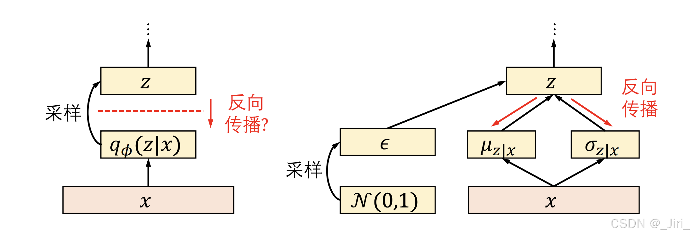

---

title: '随机函数的梯度计算'
date: 2026-03-19
summary: 'My notes on computing the gradient of random functions.'

# Which series this belongs to. Must be one of the ids in `blogSeries`
# in src/data/site.ts — currently: tech | research | life
# A typo here fails the build and names this file.
series: 'math'

tags: ['Gradient', 'Machine Learning']

cover: ../../assets/blogs/random-functions-gradient-cover.png
coverAlt: '概率分布中的随机样本经过变换后成为可沿计算图传播的梯度路径'

# true = keeps the file but publishes nothing, not even the URL.
draft: false
---

在深度学习中，我们常常会遇到神经网络输出一个概率分布，然后从这个概率分布中采样一个随机样本，然后进行接下来的计算。考虑到我们使用梯度的反向传播来训练模型的参数，如果不进行一些特殊处理，那么在计算图中，梯度传到随机采样的节点处时，就会阻塞，从而无法训练。为此，我们需要使用一些 “tricks”，来处理梯度传播中的随机采样节点。最近学习了两种方法，于是写下这篇文章复习巩固，下面分别介绍 **Reparameterization** 和 **Score-function Estimator**.

## Reparameterization trick

设想一下，我们想对如下的函数求梯度：
$$
\mathcal{L}(\theta)=\mathbb{E}_{z\sim p_{\theta}(z)}[f(z)].
$$
那么我们会遇到一些困难：当我们从概率分布 $p_{\theta}(z)$ 中采样一个 $z_0$ 时，我们在无形中就丢失了 $f(z_0)$ 和 $\theta$ 的关系，这给梯度计算带来麻烦。

Reparameterization 的思想是：选择一个 nonparameterization 的分布 $q(\epsilon)$， 然后采样一个 $\epsilon$；然后根据 $p_{\theta}(z)$ 选择一个 $g_{\theta}$，由 $z=g_{\theta}(\epsilon)$ 来生成 $z$，这样一来，我们得到：
$$
\mathcal{L}(\theta)=\mathbb{E}_{\epsilon \sim q(\epsilon)}[\tilde{f}_{\theta}(\epsilon)],
$$
where $\tilde{f}_{\theta}=f(g_{\theta})$.
$$
\nabla_{\theta} \mathcal{L}=\nabla_{\theta} \mathbb{E}_{\epsilon\sim q(\epsilon)}[\tilde{f}_{\theta}(\epsilon)]=\mathbb{E}_{\epsilon\sim q(\epsilon)}[\nabla_\theta \tilde{f}_{\theta}(\epsilon)]=\mathbb{E}_{\epsilon\sim q(\epsilon)}[\frac{\partial f}{\partial g}\cdot\frac{\partial g_{\theta}(\epsilon)}{\partial \theta}]
$$

Reparameterization 的一个 insight 是，通过改变随机采样过程把随机性排除到 $\theta$ 外部，与我们想要优化的变量独立。

下面用不太严格的方式证明 Reparameterization 的正确性。

为了证明 Reparameterization 是对的，等价于证明 $Y$ 和 $Z$ 具有相同的分布，其中 $Y$ 和 $Z$ 都是随机变量，$Y$ 由 $y=g_\theta(\epsilon)$ 产生，不妨令 $\epsilon\sim\mathcal{U}[0,1]$，$Z$ 由 $z\sim p_\theta(z)$ 采样。

Let $g_\theta(\epsilon)=F_Z^{-1}(\epsilon)$, where $F_Z(x)=\int_{-\infty}^{x}p_\theta(t)dt$ is the accumulative distribution of the random variable $Z$.
Let $F_Y$ is the accumulative distribution of the random variable $Y$.
Given $x \in [0,1]$, we have
$$
F_Y(x)=P(Y\leqslant x)=P(g_\theta(\epsilon)\leqslant x)=P(\epsilon\leqslant g_{\theta}^{-1}(x))
$$
Because $\forall x \in [0,1], P(\epsilon\leqslant x)=x$.
Therefor $P(\epsilon\leqslant g_{\theta}^{-1}(x))=g_{\theta}^{-1}(x)=F_Z(x)$, i.e. $F_Y(x)=F_Z(x)$, $Y$ and $Z$ have the same distribution.

关于 Reparameterization 在深度学习中的应用，下面分析两个具体例子。

### VAE

在 VAE 中，输入的 image 经过 Encoder 得到一个 latent space 的一个概率分布，如下图：

这里就会遇到如何在反向传播过程中处理随机采样的问题。
这里我们取 $\epsilon\sim\mathcal{N}(0,1)$，从而得到 $z=\mu_{z|x}+\sigma_{z|x}\epsilon$，
$$
\mathbb{E}_{z\sim\mathcal{N}(z;\mu_{z|x},\sigma_{z|x}^2)}[f(z)]=\mathbb{E}_{\epsilon\sim\mathcal{N}(\epsilon;0,1)}[f(\mu_{z|x}+\sigma_{z|x}\epsilon)]
$$
显然可以求梯度用于反向传播。

### Gumbel-Softmax Trick

上面的 VAE 遇到的情况是从一个 continuous 的分布中随机采样，你们如果是一个 discrete 的分布呢？情况开始变得不一样。试想一下 categorical distribution，在一些自回归任务中，我们要在一个 vocabulary 中采样一个 word，那么这个时候也会产生随机性影响梯度反向传播算法正常工作。
假设我们要计算 $\mathcal{L}(\theta)=x_i(\theta)$的梯度，$x_i(\theta)$ 是从 $\{x_i(\theta)|i=1,2,...,K\}$ 中随机采样，其中 $P(X=i)=\pi_i,\sum_{i=1}^{K}\pi_i=1$，与上面对 VAE 的处理相同，我们不想在随机抽样中引入参数，这里借助 [Gumbel distribution](https://en.wikipedia.org/wiki/Gumbel_distribution)，主要步骤是：

+ 随机采样 $\epsilon_i, i=1,...,K$, where $\epsilon_i\sim \text{i.i.d.}\ \mathcal{N}[0,1]$.
+ 计算 $G_i=-\log(-\log(\epsilon_i)), i=1,...,K$
+ $\mathcal{L}(\theta)=\argmax\{\log \pi_i + G_i\}$，可以通过多元积分的方法证明 $\mathcal{L}=i$ 的概率就是 $\pi_i$. 证明比较复杂，此处略去。
+ 由于 $\argmax$ 仍然不可导，继续替换为 softmax，引入温度 $\tau$，$\mathcal{L}(\theta)=\text{softmax}(\log(\pi_i)+G_i;\tau)$，于是就可以计算梯度用于反向传播。

这一个 Trick 我个人认为比较难理解，我最初的困惑是为什么不直接使用 $\pi_i$ 做 softmax，而是对 $\log \pi_i + G_i$ 做 softmax。我发现，如果直接使用$\pi_i$ 做 softmax，那么得到的是一个确定的结果，完全违背了 random sampling 的初衷，使用 $\log \pi_i + G_i$，在引入随进性的同时，我们保证随机性不影响需要优化的 parameters，并且可能通过比较复杂的证明 $\argmax(\log \pi_i + G_i)$ 得到某一个具体值 $i$ 的概率就是 $\pi_i$，从而说明这一个操作并没有改变 categorical distribution 的逻辑。

值得一提的是，也有[新的方法](https://arxiv.org/abs/2311.12569)来计算 categorical distribution 的梯度。

## Score-function Estimator

这种方法可以用来计算这些问题的梯度：

+ 随机变量是离散的
+ 目标函数形如 $\mathcal{J}(\theta)=\mathbb{E}_{x\sim p_{\theta}(x)}[f(x)]$.

这种方法的关键是这样的一步代换：$\nabla_\theta p_{\theta}(x)=p_\theta(x)\nabla_\theta\log p_\theta(x)$.

于是，
$$
\mathcal{J}(\theta)=\mathbb{E}_{x\sim p_{\theta}(x)}[f(x)]=\int p_\theta(x)f(x)dx
$$
$$
\nabla_\theta \mathcal{J}(\theta)=\int f(x)p_\theta(x)\nabla_\theta\log p_\theta(x)dx=\mathbb{E}_{x\sim p_{\theta}(x)}[f(x)\nabla_\theta p_\theta(x)]
$$
如果 $f(x)=f_\theta(x)$，使用求导的乘积法则即可。

这种方法一个比较大的缺点是，具有很大的 variance，如果 $f(x)$ 变化很大，那么会引入很大的噪音，让 $f(x)\nabla_\theta p_\theta(x)$ 变化很大，使得优化困难。
