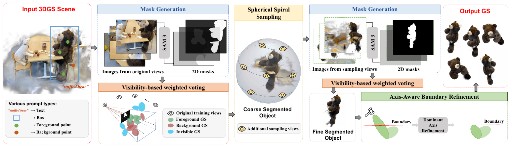
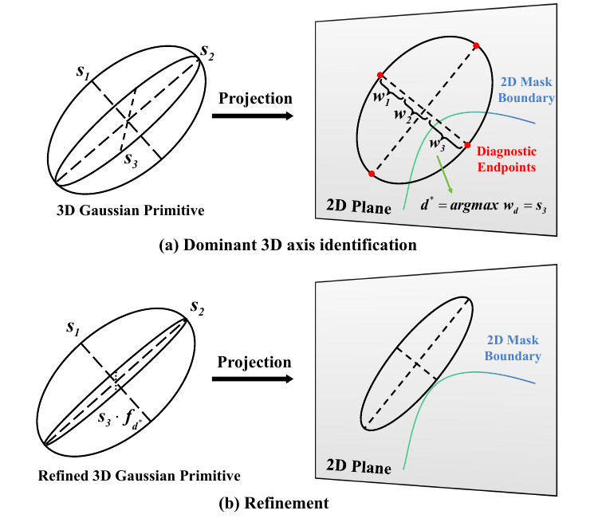

论文：[VCAR: Training-Free 3DGS Segmentation via View Completeness and Axis-Aware Boundary Refinement](https://arxiv.org/abs/2608.30870v1)。

VCAR 从已有 3DGS 中提取指定目标，处理两类错误：视角不足使背景高斯被误选；目标边界上的高斯虽然归属正确，椭球却伸出了轮廓。前者通过补充视角后重新投票处理，后者通过压缩造成越界的局部尺度轴处理。

## 输入、输出与模块

输入是已重建的高斯场景 $\mathcal G$、训练相机的内外参，以及参考视角上的目标提示，支持文本、框、前景点和背景点。每个高斯保存中心 $\mu_i$、旋转 $R_i$、三轴尺度 $s_i$、不透明度 $\alpha_i$ 和 SH 系数。

输出是目标高斯子集，部分边界高斯的尺度会被修改。一次流程围绕一个指定目标做前景／背景二分类；若要分别提取多个实例，需要分别查询。一个 mask 可以覆盖多个物体，但流程不会自动给它们分配独立实例 ID。

结构由 **3DGS 渲染器（gsplat）、预训练 SAM 3、投票、相机采样与几何修整**组成。SAM 3 以视频分割模式处理渲染帧序列，生成逐帧二值 mask。VCAR 没有新增的三维编码器、语义特征蒸馏或场景级分割训练；training-free 不包括上游 3DGS 重建。

完整顺序是：训练视角渲染完整场景 → SAM mask → 粗投票 → 覆盖度检查 → 必要时 SSS 补视角、仅渲染粗分割高斯、重新分割与投票 → ABR。覆盖足够时跳过补视角的细分割阶段。

## Voting：用中心投影决定高斯归属

对高斯 $g_i$ 和视角 $j$，先投影中心 $\mu_i$，得到像素位置 $m_i^{(j)}$ 与相机空间深度 $z_i^{(j)}$。按以下规则赋标签：

| 条件 | 标签 $l_i^{(j)}$ | 计票方式 |
| --- | ---: | --- |
| 深度为正，中心投影在图内且位于前景 mask | $1$ | 前景票 |
| 深度为正，中心投影在图内但位于背景 | $0$ | 背景票 |
| 中心在相机后方或投影在图外 | $-1$ | 不参与 |

只在参与投票的视角中计算前景比例：

$$
R_i=
\frac{\sum_j\mathbf 1[l_i^{(j)}=1]}
{\max\left(\sum_j\mathbf 1[l_i^{(j)}\ne-1],1\right)},
\qquad g_i\text{ 被保留}\iff R_i\ge\tau.
$$

例如标签为 $[1,1,1,0,-1,-1]$ 时，比例为 $3/4$，不是 $3/6$；没有有效视角时比例为零。

论文称其为 visibility-based weighted voting，但公式中有效视角等权，不可见视角权重为零，没有按 opacity、置信度或 alpha blending 贡献加权。它也只查询**中心所在像素**，不计算投影椭圆与 mask 的重叠面积。

这里的 visibility 只是深度和图像范围检查，**没有显式遮挡测试**。背景高斯即使被目标挡住，中心投影仍可能落入目标 mask 并获得前景票。多个相似方向重复投票未必能排除它，需要不同方向的约束。

粗阶段通常采用较低阈值保住目标，细阶段提高阈值排除混入的高斯。论文默认 NVOS 为 $0.5\to0.8$，LERF 为 $0.4\to[0.5,0.7]$。

## SSS：围绕粗分割结果补充观察方向

### 确定采样中心与距离

取粗分割集合 $\mathcal G_{\mathrm{coarse}}$ 中的高斯中心，先求均值 $\bar\mu$，再计算距离 $d_i=\|\mu_i-\bar\mu\|_2$。去掉 $d_i>\mu_d+3\sigma_d$ 的离群点，用剩余点重新求中心 $c$，避免少量远处误选高斯拉偏采样位置。

采样球半径为：

$$
r=\eta\|v_{\mathrm{ref}}^{\mathrm{pos}}-c\|_2,\qquad\eta=1.2.
$$

半径取参考相机到目标中心距离的倍数，并非目标点到中心的最大距离。新相机位于这个球面，全部朝向 $c$。

### 检查是否需要补视角

先筛选训练相机：至少有 20% 的粗分割高斯中心满足深度和图像范围条件，才计为有效相机。按补充材料式（A.2），将相机位置转换为从目标中心出发的单位方向：

$$
h_j=\frac{v_j^{\mathrm{pos}}-c}{\|v_j^{\mathrm{pos}}-c\|_2}.
$$

用 Fibonacci lattice 在单位球面放置 $K=2000$ 个测试方向 $t_i$，计算每个方向到最近有效相机的夹角，再取最差值：

$$
\Delta_{\max}
=\max_i\min_j\angle(t_i,h_j)
=\max_i\arccos\left(\max_j t_i^\top h_j\right).
$$

当 $\Delta_{\max}>90^\circ$ 时启用 SSS，否则跳过。这衡量的是是否存在很大的方向空缺。2000 个方向仅用于探测，不会渲染成 2000 张图。

### 生成螺旋相机并重新分割

设绕行圈数为 $S_1$，每圈采样数为 $S_2$，总数 $N_s=S_1S_2$。对 $k=0,\ldots,N_s-1$：

$$
\theta_k=2\pi S_1\frac{k}{N_s},\qquad
\phi_k=\phi_s+(\phi_e-\phi_s)\frac{k}{N_s-1},
$$

$$
p_k=c+r(\cos\phi_k\cos\theta_k,\cos\phi_k\sin\theta_k,\sin\phi_k).
$$

默认 $S_1=4,S_2=8$，共 32 个视角，仰角由 $-60^\circ$ 变化到 $60^\circ$。相机一边绕行一边升高，连续的位姿变化有利于 SAM 3 的视频分割。覆盖检查决定是否触发采样，采样本身采用预设螺旋，并非逐个针对空缺方向放置相机。

按正文第 3.3.3 节，细阶段使用 $\mathcal V_{\mathrm{fine}}=\mathcal V_{\mathrm{train}}\cup\mathcal V_{\mathrm{sampled}}$，但**只渲染 $\mathcal G_{\mathrm{coarse}}$**。去掉多数其他物体后，遮挡和干扰减少；重新运行 SAM 3 和同一投票规则，得到 $\mathcal G_{\mathrm{fine}}$。只在正面投影中与目标重合的背景高斯，有机会从侧面暴露并被排除。

新视角始终来自已有重建，不能补出缺失几何。按这个高斯子集筛选流程，粗阶段已经误删的目标高斯也无法在后续恢复，因此粗投票需要留有余量。

## ABR：把二维越界归因到三维局部轴

Voting 判断的是中心归属。ABR 进一步检查高斯的投影范围，并更新尺度，避免中心属于目标而椭球伸出轮廓。

### 检查四个端点，并要求跨视角支持

对某视角中的二维投影协方差做特征分解：

$$
\Sigma_{2D}=U\operatorname{diag}(\lambda_1,\lambda_2)U^\top.
$$

令特征向量为 $e_1,e_2$，使用 $\sigma_c=3$ 的截断，检查椭圆四个端点：

$$
\mathcal E=\{m\pm3\sqrt{\lambda_1}e_1,\ m\pm3\sqrt{\lambda_2}e_2\}.
$$

根据补充材料 B.1，只有中心在图内且位于前景 mask 的观测才合格。任一端点落到背景或图外，就记该视角越界。对每个高斯统计：

$$
\gamma_i=\frac{n_i^{\mathrm{ovf}}}{n_i^{\mathrm{eligible}}}.
$$

这里将原文 $n_i^{\mathrm{vis}}$ 写成 $n_i^{\mathrm{eligible}}$，强调分母是**中心位于前景的合格观测数**，与 voting 的分母不同。只有 $\gamma_i>\rho=0.6$ 才应用压缩。

补充材料 B.3 还明确：ABR 使用原始训练视角与最新完成分割轮次保留的对应 mask，排除缺失 mask 的视角和 SSS 新增视角。

### 找出对越界方向贡献最大的轴

三维高斯的局部轴是旋转矩阵 $R$ 的列向量 $r_d$，尺度为 $s_d$。协方差可按轴展开：

$$
\Sigma_{3D}=\sum_{d=1}^{3}s_d^2r_dr_d^\top.
$$

设 $W_R$ 为世界到相机的旋转，$J$ 为高斯中心处的透视投影雅可比，$M=JW_R$。令 $q_d=Mr_d$，得到每根局部轴在图像上的线性化投影：

$$
\Sigma_{2D}=\sum_{d=1}^{3}s_d^2q_dq_d^\top.
$$

对越界端点的有符号单位方向 $u\in\{\pm e_1,\pm e_2\}$，该方向的方差为：

$$
\lambda=u^\top\Sigma_{2D}u
=\sum_{d=1}^{3}\underbrace{s_d^2(u^\top q_d)^2}_{w_d},
\qquad d^*=\arg\max_d w_d.
$$

$w_d$ 同时考虑轴的长度和它沿当前越界方向的投影贡献。很长但近似朝向相机的轴，投影贡献可能很小。二维长短轴也不是某两根三维轴的直接投影，必须先做上述分解才能归因。

### 从 mask 边界距离求压缩系数

沿中心到越界端点的线段均匀采样 129 个位置并查询 mask，找第一次离开前景的位置；以最后一个前景样本与第一个非前景样本的中点估计边界，得到距离 $\ell_u$。

仅把主导轴改为 $s_{d^*}'=f s_{d^*}$，保持原方向 $u$ 和线性化投影不变。该轴的方差贡献变成 $f^2w_{d^*}$，于是：

$$
V_u'=\lambda-w_{d^*}+f^2w_{d^*}.
$$

要求新的方向性 $3\sigma$ 范围匹配边界，即 $3\sqrt{V_u'}=\ell_u$，解得：

$$
f=\sqrt{\frac{(\ell_u/3)^2-\lambda+w_{d^*}}{w_{d^*}}}.
$$

例如三轴贡献为 $(81,16,3)$，原方向方差为 100，范围为 30 像素。若边界在 24 像素处，目标方差为 64，应将第一轴乘以 $\sqrt{(64-19)/81}\approx0.745$。不能直接乘 $24/30$，因为另外两轴的贡献保持不变。

### 按“高斯—轴”合并多视角约束

每个越界端点给其主导轴提出一个候选 $f$。对同一高斯的同一根轴，取所有候选的最小值，再限制到 $[f_{\min},1]$，默认 $f_{\min}=0.1$；没有被归因的轴保持原尺度。通过前面的越界比例门槛后，在对数尺度上更新：

$$
\log s_{i,d}\leftarrow\log s_{i,d}+\log f_{i,d}^{\mathrm{final}}.
$$

不同视角可以选中不同局部轴，因此一次端点观测只归因一根轴，同一个高斯最终可能有多根轴被压缩。

如果 $(\ell_u/3)^2\le\lambda-w_{d^*}$，其他两轴的贡献已经达到或超过允许值，仅缩主导轴无解，补充材料规定使用 $f_{\min}$。这也说明“压到边界”有条件：ABR 使用线性化、固定方向的修正，只检测四个端点，并不保证整个椭圆严格包含在任意形状的 mask 内。取最小系数还可能过度侵蚀细结构。
